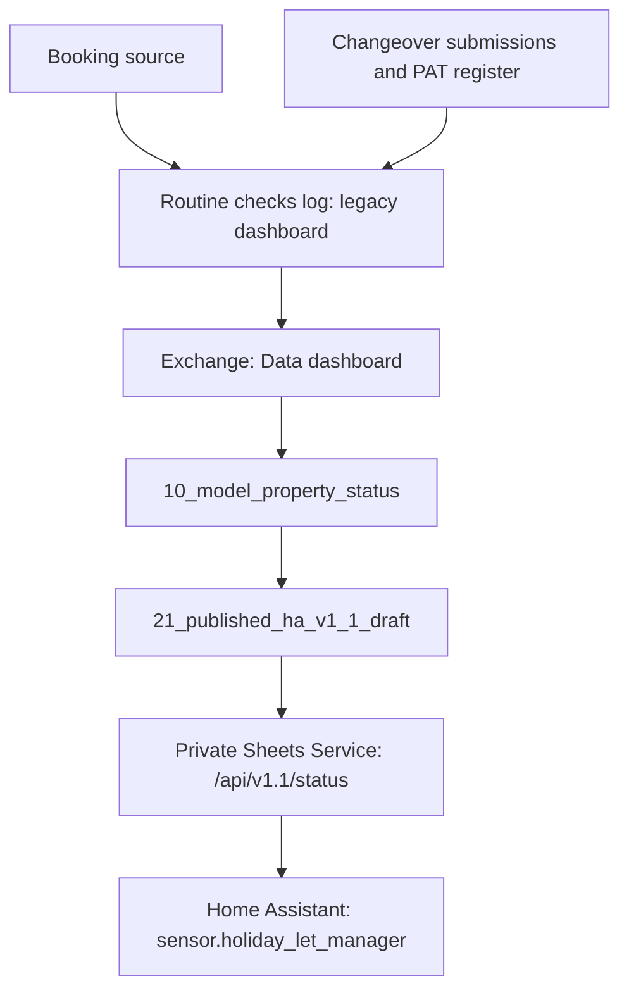
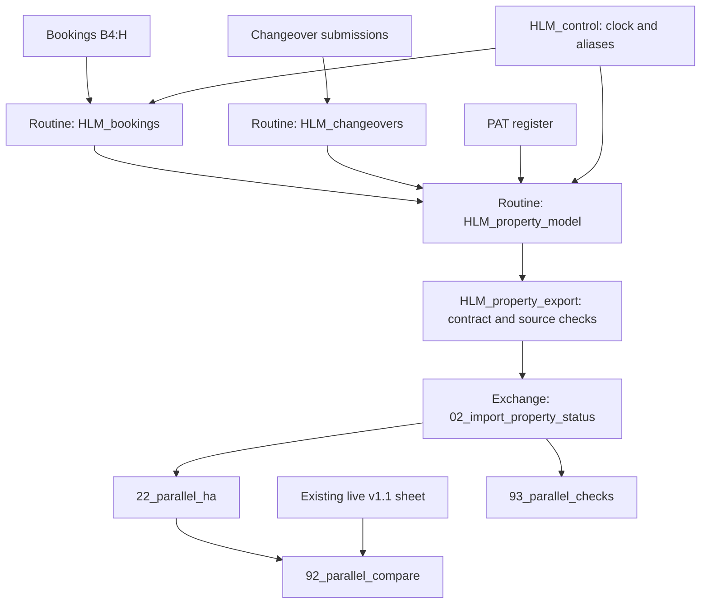

# HLM Sheets Service architecture

As built on 12 September 2026. The production service remains on its existing
source; the redesigned Sheets path is a parallel candidate.

## Production status path

The launcher sets separate ranges for v1.0 (`20_published_ha!A1:R`) and
v1.1 (`21_published_ha_v1_1_draft!A1:AA`). The v1.1 range is the production
status source despite its historical name. The service reads the private
Exchange workbook, validates the contract and projects it into JSON.
The Apps Script solution remains deployed as a backup/parity reference;
the private service became the production feed on 3 September 2026.

## Parallel source path

There is one booking `IMPORTRANGE` into Routine and one compact transfer
from Routine to Exchange. Changeover and PAT data remain local to Routine.
This centralizes property normalization and calculations rather than
repeating source imports through dashboard formulas. Old imports remain
active during comparison, so total workload has not yet been reduced.

`22_parallel_ha` has no service endpoint or HA consumer. Comparison results
recalculate in Sheets and do not constitute a historical audit or scheduled
monitor. `94_parallel_issue_log` records observations and deferred changes.

## Trust and failure boundaries

The status service uses read credentials and bearer authentication on the
internal add-on network. The Sheets editing account is distinct from the
runtime service identity. Source sharing permissions do not replace runtime
credential checks. Keep credentials and live source URLs outside Git.

The parallel import omits guest names and financial columns and selects only
property, dates, channel, reference and notes. Its publishing formula gates
output on source validation. Invalid input must not silently become a vacant
or ready property. This stricter error behaviour needs edge-case acceptance
against the legacy formulas before migration.

`source_updated_at` currently means spreadsheet recalculation time in both
paths. It does not prove the booking producer refreshed successfully.
An authoritative upstream heartbeat is deferred work.

The separately authenticated `POST /api/v1/events` writer and `30_hlm_events`
are outside this source refactor. Its token, writer identity, validation and
deduplication boundary are unchanged; see the [service README](README.md).

## Deployment boundary

No add-on code, version, runtime range, HA entity or backup deployment changed
for the parallel feed. A future cutover requires the acceptance gates in the
[feed design](PARALLEL_FEED_DESIGN.md), candidate endpoint validation and an
explicit deployment decision. Preserve the existing live range for rollback;
do not assume renaming the candidate tab switches consumers.
